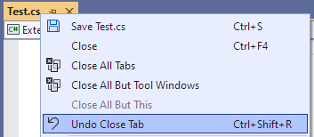
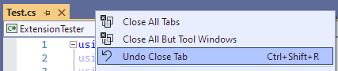
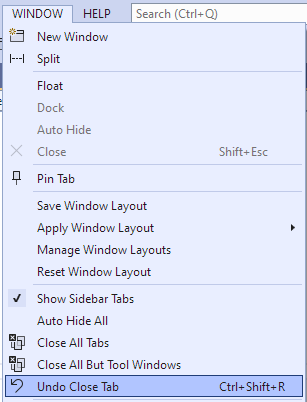

# Undo Close Tab

A Visual Studio extension to re-open the last closed tab.

## How To Use

Press <kbd>Ctrl</kbd>+<kbd>Shift</kbd>+<kbd>R</kbd> to re-open the last closed tab.

You can also use the menu items available from a number of menus.

The tab menu:

The tab-well menu:

The _Window_ menu:

